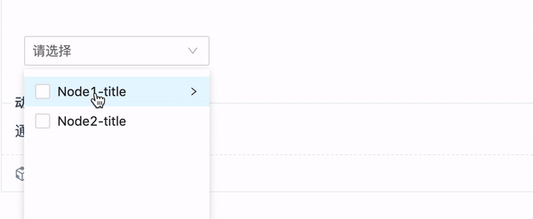

# cascader-plus

## CascaderPlus介绍

扩展 ant-design 级联组件 cascader，实现级联选择的多选功能，并且支持本地及远程搜索。

## 主页

### [CascaderPlusAPI文档](https://jeasonsun.github.io/cascader-plus/)

### 功能截图

#### 异步获取数据



#### 多选远程搜索


## 功能

- [x] 多选功能
- [x] 默认值设置
- [x] 动态加载下一级
- [x] 多选搜索
- [x] 多选远程搜索
- [x] 禁用
- [x] 设置父级节点选中是否关联
- [x] 自定义值渲染
- [x] 自定义Item样式
- [x] selectLeafOnly只允许选择Leaf节点
- [ ] allowClear
- [ ] selectAll
- [ ] 单选

## 快速开始

安装依赖：

```bash
$ npm i
```

启动开发服务,

```bash
$ npm start
```

构建文档,

```bash
$ npm run docs:build
```


